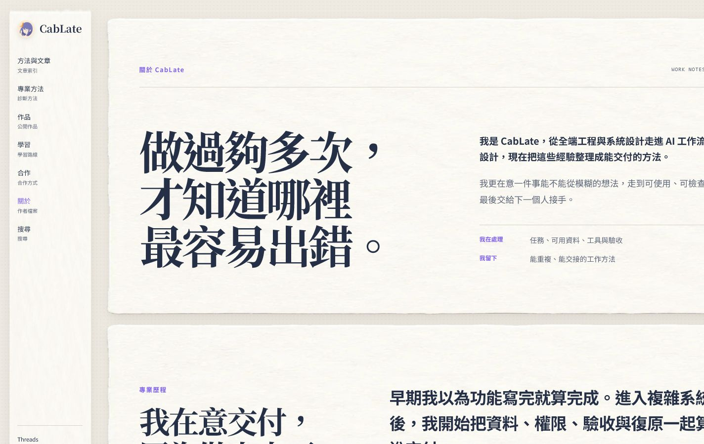
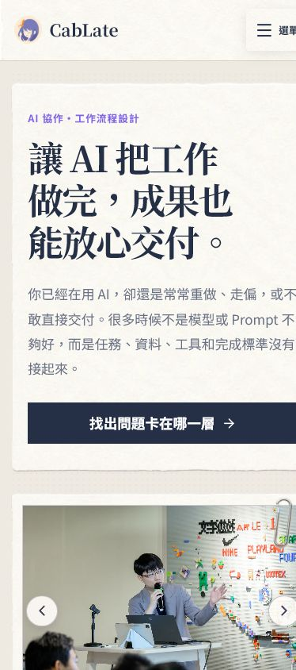
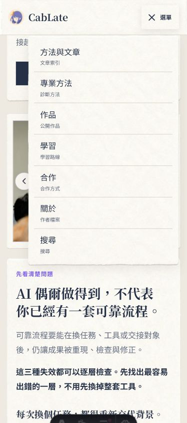
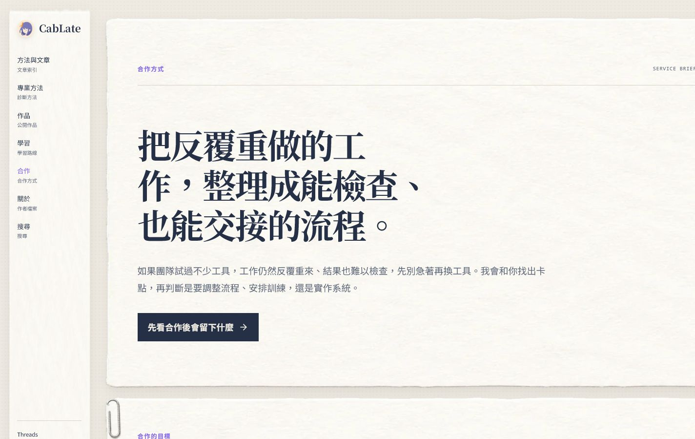
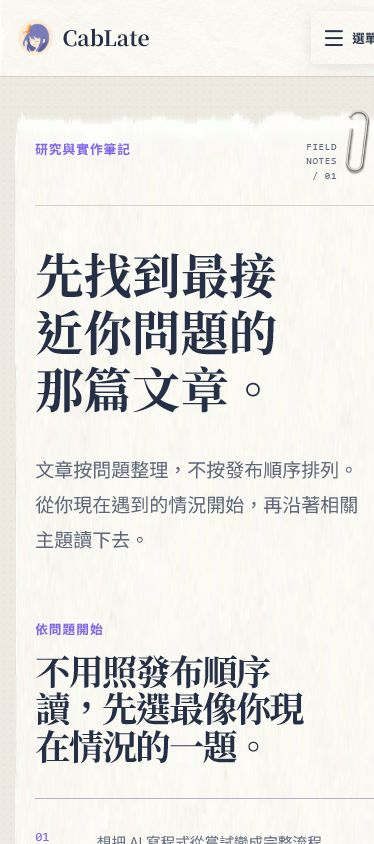

# CabLate 個人網站 Persona Final Audit

## 1. Audit scope 與判定方式

這一輪不是重新設計，也沒有修改程式碼。目標是用不同訪客的閱讀旅程，檢查網站是否真的完成 master plan 所要求的事情：

> 讓正在使用 AI、卻遇到失控、重做或無法交付的人，看清問題卡在哪裡，接著選擇一個合理、負擔得起的下一步。

檢查面向包括：

- 五種訪客從進站到下一步的理解、情緒與信任變化。
- 七個主要入口頁的唯一責任、內容密度、CTA 與跨頁分流。
- 紙面材質、紫色識別、固定導覽、桌機／手機閱讀順序與安全內距。
- 手機選單、輪播、hash scroll、active navigation、錯誤日志與基本語意。
- `npm run check`、`npm run validate:content`、`npm run build`、`git diff --check` 的現況。

本報告新增的是 audit 文件；既有 dirty worktree 的程式碼、內容與刪除項目均未在本輪改動、commit 或 push。

## 2. Evidence 與測試基線

### 2.1 截圖與 viewport

有效截圖存放於 [`docs/design/audits/2026-07-12-persona-site-audit/`](2026-07-12-persona-site-audit/)。桌機截圖為約 `1424 × 899` 的可見畫面，瀏覽器 CSS viewport 為 `innerWidth 1440 / clientWidth 1425`；手機截圖為約 `374 × 844` 的可見畫面，CSS viewport 為 `innerWidth 390 / clientWidth 375`。

`01-home-desktop.png` 是錯誤的 full-page 重複拼接圖，沒有用作判定；本報告只引用 `01-home-desktop-viewport.png` 與各頁的 `desktop-*.png`、`mobile-*.png`。







### 2.2 已完成的互動與靜態檢查

| 檢查 | 結果 | 判定 |
|---|---|---|
| `npm run check` | 0 errors、0 warnings、17 hints | 可繼續；hints 仍應清理 |
| `npm run validate:content` | 通過 | 通過 |
| `npm run build` | 49 pages built | 通過；仍有 8 個 asset warnings |
| `git diff --check` | 通過 | 無 whitespace error |
| Browser warn/error logs | 0 筆 | 通過 |
| Mobile menu | 可開啟、關閉，紙張容器不溢出 | 通過 |
| Active navigation | 七個主要入口皆正確 | 通過 |
| Home `#diagnosis` | hash 與 sticky header offset 正常 | 通過 |
| Hero carousel | 箭頭、圓點、左右鍵、`aria-current`、圖片 alt 正常 | 通過互動；語意仍有 P2 |
| 七個入口語意 smoke test | 各 1 個 H1、缺少 alt 0、duplicate ID 0、空白 link/button 0 | 基線通過 |

## 3. Overall verdict

### 3.1 已經成立的部分

CabLate 已經不是「堆滿 AI 名詞的個人首頁」。目前最有價值的完成度有三項：

1. **主張變得可重述。**「讓 AI 把工作做完，成果也能放心交付」與「判斷力比執行力值錢」能讓陌生訪客在首頁知道這不是工具清單，而是工作流程與交付判斷。
2. **頁面分工已經辨認得出來。** Home 負責分流，About 講方法如何形成，Expertise 做診斷，Work 放案例證據，Courses 放學習選擇，Services 講合作邊界，Articles 做問題索引。
3. **紙面視覺已經成為品牌語法。** 暖白紙張、紫色標籤、固定側欄、照片與迴紋針互相支持，不需要再靠大量生成圖片才能成立。

### 3.2 目前不能直接 production sign-off 的原因

最優先的問題不是「哪張紙不好看」，而是**跨頁的可見內容被裁切**。桌機 About 的人物說明、右上索引，Work 的 `RECORD NOTE`，以及手機 header、hero 與各頁右上索引都有同一類風險。畫面雖然 `scrollWidth === clientWidth`，仍可能因 `overflow: clip`、紙張背景放大、固定欄與 scrollbar 造成實際 clipping；因此不能只看 overflow 數值宣布通過。

在裁切修好以前，訪客可能看不到 CTA 的尾端、頁面定位索引或人物說明的完整句子。這會直接破壞理解、信任與下一步選擇，列為 **P1 release blocker**。

## 4. 五種訪客的閱讀模擬

### 4.1 AI 初學者：想知道「我到底該從哪裡開始」

**第一眼看到什麼。** 他會先讀到 Home 的 H1 與「你已經在用 AI，卻還是常常重做、走偏，或不敢直接交付」，這比「AI 生產力」或工具名稱更容易對上自己的經驗。

**理解與情緒。** 先被說中，接著從「任務、資料、工具和完成標準沒有接起來」得到一個比「Prompt 寫不好」更完整的解釋，會有鬆一口氣的感覺。三條路徑中，「先把 AI 用得更穩」是最自然的入口。

**信任來源。** Home 的診斷例子與真實追查案例，比抽象頭銜更能建立信任；About 的經歷可作為第二次確認。

**困惑／疲勞點。** 進入 Expertise 後，`Context Engineering`、`Harness Engineering`、`Skill` 等術語可能早於白話解釋出現。若手機右側裁切，連「選單」或 hero 的句尾都看不完整，初學者會把視覺問題誤認為網站內容不完整。

**最自然下一步。** 先進問題指南或 Home 的診斷區，再讀一篇對應文章；不應直接被 Courses 或 Services 的商品／合作訊息攔截。

**CTA 判定。** 「找出問題卡在哪一層」是好的低門檻 CTA。需要補的是 Expertise 各層一行白話說明，讓初學者知道點下去會得到什麼。

### 4.2 已在使用 AI、但總是重做的個人工作者

**第一眼看到什麼。** 他會直接被「AI 偶爾做得到，不代表你已經有一套可靠流程」與三個失效情境吸引，因為這些描述對應到每天的重做成本。

**理解與情緒。** 從挫折轉為可拆解：問題不一定是換模型或加規則，而是背景、驗收與復原沒有留下來。這是整站最強的情緒轉折。

**信任來源。** Home 的追查故事、Work 的「問題／限制／判斷／公開結果」結構，以及 Articles 的實作紀錄共同提供證據。

**困惑／疲勞點。** 他可能擔心讀完最後只會被導向工程手冊或顧問服務。Courses 若同時展示多條路線，容易看成商品牆；Services 若連續七張紙卡，則會增加「我要先研究完才敢聯絡」的心理負擔。

**最自然下一步。** 讀一篇最接近目前失效現象的文章，讀完再決定是否需要深度手冊或合作。

**CTA 判定。** Home → Articles 的路徑合理；Articles 每篇摘要應更直接寫出「讀完會知道什麼」，避免只說文章記錄了什麼。

### 4.3 想把一個想法做完的開發者

**第一眼看到什麼。** 他會對「能使用、能部署，也能繼續維護」有反應，接著查看 Work 來確認 CabLate 是否真的做過交付，而不是只會分享觀點。

**理解與情緒。** Work 的案例檔案語法讓他看到限制與取捨，信任上升；若從 Courses 進入，學習地圖也能讓他選擇目前缺的那一層，而不必一次學完全部。

**困惑／疲勞點。** Courses 的未開放項目若和可開始內容同等突出，會延遲決策；Work 案例若在手機先呈現完整長文，會在真正讀到結果前消耗注意力。

**最自然下一步。** 先看一件與自己相近的 Work 案例，再選一個目前可取得的學習入口。`查看合作方式` 不應和學習 CTA 競爭。

**CTA 判定。** 需要一個明顯的「目前可開始」路線，其他未開放內容縮成狀態提示即可。

### 4.4 企業／團隊決策者

**第一眼看到什麼。** Services 的 H1「把反覆重做的工作，整理成能檢查、也能交接的流程」和成果導向的副文案，能快速判斷這不是單次展示或工具採購頁。

**理解與情緒。** 他會先確認合作後留下什麼，再看投入、流程與邊界；若資訊順序維持現在的「情境 → 成果 → 流程」，會從戒心轉為適配評估。

**信任來源。** Work 的公開案例與 About 的交付經驗，比大量工具名稱更有說服力。

**困惑／疲勞點。** 服務頁連續七張紙卡使手機閱讀變長；`fit / not fit / deliverables / process / boundaries` 若同時以同等視覺權重出現，決策者仍要自己整理「我現在要提供哪些資料」。桌機右側裁切也可能藏掉服務索引或 CTA。

**最自然下一步。** 先讀合作成果與流程，再提交合作情境；不需要先選方案名稱。

**CTA 判定。** 「先看合作後會留下什麼」是好的 Primary CTA，但頁面尾端應只保留一個提交情境的主要動作，其他連結降為證據或補充。

### 4.5 熟人／合作轉介者：想快速確認「你現在在做什麼」

**第一眼看到什麼。** 他通常先看照片、CabLate 身份與 About，而不是先讀 Expertise。About 的故事與時間軸能把「全端工程 → AI 工作流程設計 → 可交付方法」串起來。

**理解與情緒。** 若能在經歷段落讀到一個清楚的「過去經驗如何形成現在方法」轉折，會從熟人印象轉成可轉介的描述；目前這個連接仍需要訪客自己推論。

**信任來源。** 真實照片、代表作品與可公開的限制說明，比自我形容詞更可信。

**困惑／疲勞點。** 右側人物說明與右上 `WORK NOTES` 裁切時，About 最重要的第一屏訊息會變成半句；導覽上的英文索引也可能讓只想確認服務內容的人多一步解碼。

**最自然下一步。** 查看代表作品，接著轉到 Services；Threads／GitHub 是補強，不應搶主要 CTA。

**CTA 判定。** About 的作品 CTA 合理，但需要一段更白話的「這些經歷如何變成現在的工作方式」。

## 5. 七個主要入口逐頁 review

| 頁面 | 已完成的閱讀任務 | 目前主要問題 | 建議下一輪 |
|---|---|---|---|
| Home | 用一個主張說中失控，再以診斷、身份與三條路徑分流 | hero／header 在手機右側裁切；標題 DOM 仍有幾處不必要空格；更新通知的實際寄送流程尚未驗證 | 先修可見邊界；再做標題 proofreading 與唯一 Primary CTA 檢查 |
| About | 用故事、經歷與時間軸建立「為何相信」 | 桌機／手機右欄裁切；經歷到方法的連接需更直白 | 修容器寬度後，補一個過渡句並縮短首屏右欄 |
| Expertise | 以症狀 → 層級 → 延伸文章提供排查順序 | 術語對初學者有門檻；右側 CTA／索引裁切 | 每層補白話「這一層要解決什麼」與一個閱讀入口 |
| Work | 以問題、限制、判斷、結果展示可檢查證據 | `RECORD NOTE` 裁切；手機案例過長 | 案例先給結果摘要，再展開完整檔案；保留公開範圍 |
| Courses | 以學習地圖協助選擇剛好的深度 | 多條路線可能像商品牆；右上索引裁切 | 突出一條目前可開始的路線，未開放項目降級 |
| Services | 先講情境與成果，再講流程與合作邊界 | 七張紙卡連續閱讀疲勞；資料投入與 CTA 權重仍偏分散 | 收斂成「適合誰／完成後／怎麼合作／提交情境」四段 |
| Articles | 以真實問題作索引，不把最新文章當唯一入口 | 特色文章可能搶走問題索引；摘要未固定承諾讀者收穫 | 每篇摘要補「讀完會知道什麼」；分類／標籤只作次要工具 |

代表畫面：





## 6. UIUX 與可及性發現

### P1 — 跨頁內容裁切，阻斷理解與 CTA

**症狀。** 桌機 About 的人物說明與右上索引、Work 的 `RECORD NOTE`、Courses／Services／Articles 的右上索引，以及手機 header、hero 與各頁右側內容，都在截圖中被裁掉或貼近可見邊界。

**可疑邊界。** `body { overflow-x: clip; }`（`src/styles/base.css`）、`.paper-page`／手機 `#main-content` 的 `overflow: clip`（`src/styles/global.css`），以及紙張背景使用超過容器的 `background-size`。固定側欄與垂直 scrollbar 造成的 `1440 → 1425` 可用寬度差也可能放大問題。

**為何是 P1。** 這不是純裝飾：被裁掉的可能是 CTA 尾端、頁面定位、人物解釋或案例標籤。訪客會看不完整、誤判內容品質，甚至無法選擇下一步。

**驗收條件。** 在 `1440 × 900` 與 `390 × 844` 實際畫面，七頁的標題、右上索引、CTA、紙張安全內距與手機選單都完整可見；不能只以 `scrollWidth === clientWidth` 當作通過。

### P2 — 首頁巢狀 `<main>`

`BaseLayout.astro` 已輸出 `<main id="main-content">`，`src/pages/index.astro` 又輸出 `<main class="desk-content">`。這會讓 landmark 語意重複，對 screen reader 導覽與未來 CSS 選擇器都增加不必要風險。首頁應保留一個主要 landmark。

### P2 — Carousel 語意尚可用，但還不完整

`HeroCarousel.astro` 已有輪播 label、圖片 alt、圓點 `aria-current`、箭頭與左右鍵；但投影片只有 `aria-roledescription="投影片"`，沒有明確 `role`，也沒有依目前索引切換 `aria-hidden`。建議把外層定義成清楚的 region，投影片使用可被輔助技術辨識的 role，並讓非目前投影片不進入閱讀順序。

### P2 — 標題斷句與空格需要最後 proofreading

目前部分標題由人工 `<br>` 與 DOM 空白共同控制，已看到「判斷力比 執行力值錢」、「規則愈加愈多， 為什麼 AI 還是會 忘記、重做」等不必要空格。即使 CSS 換行看起來合理，讀屏、複製文字與窄螢幕 fallback 仍可能留下 proofreading 錯誤。標題應逐個在桌機與手機實際畫面回讀。

### P2 — Focus 與 reduced-motion 尚未完成真實 QA

全域與輪播已有 `prefers-reduced-motion` 規則，內容在動畫失效時仍可顯示；但本輪尚未在真實 reduced-motion 模式完成完整輪播、選單與 skip link 互動驗證。IAB 也未能提供可靠的 `:focus-visible` active element 證據，因此不能宣稱鍵盤可及性已完整通過。

### P2 — 內容密度與 CTA 競爭

Services、Work、Courses 的資訊量在手機連續堆疊；Articles 的特色文章、問題索引、分類／標籤可能同時爭奪入口。這不是要刪掉證據，而是先讓訪客做一個決策，再把細節放在展開或次要層級。

### P3 — 紙面語法仍需用途導向

紙張、迴紋針與英文索引已經建立辨識度，但同一種紙卡節奏若在每頁大量重複，會讓內頁像同一個模板。後續只保留能協助分組、定位、比較或敘事的裝飾；不要為了填空白再加素材。

## 7. 優先級與建議實作順序

### Phase 0 — 先讓所有內容看得見（P1）

1. 以 desktop／mobile 截圖逐頁定位 clipping 的實際元素與父容器。
2. 修正 paper page、header、固定側欄與 content wrapper 的可用寬度計算；避免用全域 `overflow: clip` 掩蓋問題。
3. 重新截取七頁兩種 viewport，確認標題、右上索引、CTA、footer 與紙張邊緣完整。

### Phase 1 — 語意與文字可信度（P2）

1. 移除首頁巢狀 `<main>`。
2. 逐一清理標題 DOM 空格、人工斷行與手機版句尾。
3. 為 Expertise 術語加第一次出現的白話說明。
4. 確認 Newsletter 是「重要更新通知」而不是未實際運作的電子報承諾。

### Phase 2 — 收斂每頁的決策成本（P2）

1. Home 只保留「選路徑」的 Primary CTA。
2. Courses 突出目前可開始的一條路線；未開放項目只保留狀態。
3. Services 收斂為適配、成果、流程、提交情境四個決策段落。
4. Work 先顯示結果摘要，再提供完整案例檔案。
5. Articles 讓問題索引先於特色文章，摘要固定寫讀者收穫。

### Phase 3 — accessibility 與互動 QA（P2）

1. 完成 carousel 的 region／slide role、目前／非目前投影片語意。
2. 用真實鍵盤流程驗證 skip link、導覽、手機選單、CTA 與 carousel。
3. 用 reduced-motion 環境重新驗證內容可見與互動可用。
4. 清理 17 個 check hints，並追查 build 的 8 個 asset warnings。

### Phase 4 — production gate

重新執行：

```text
npm run check
npm run validate:content
npm run build
git diff --check
```

再完成七頁桌機／手機截圖、404／privacy／archive smoke test，確認 Starter Pack 仍為預期 404，最後才進行 commit checkpoint。這一輪 audit 不代表 production sign-off；P1 clipping 修好並重新取證後才可簽核。

## 8. Evidence limits

- 本輪以七個主要入口頁為主；文章內頁、課程內容頁與搜尋頁沒有進行完整內容／視覺重整，不能把本報告解讀成所有路由的完整 accessibility compliance。
- IAB 可以驗證點擊、輪播、選單、hash scroll、錯誤日志與可見截圖，但無法提供可靠的 `:focus-visible` active element 證據；鍵盤焦點仍需在實際鍵盤或自動化瀏覽器中補測。
- 沒有在本輪寄出電子報或驗證 GA4 後台數據，因此「更新通知」的實際送達與轉換效果尚未證實。
- 內容檢查是以 2026-07-12 的工作樹與截圖為基準；任何後續文案、字型、瀏覽器 scrollbar 或圖像資產變更，都需要重跑 viewport QA。

## 9. Final audit conclusion

CabLate 的方向已經對了：它能讓訪客先看見自己的失效情境，再相信「問題可以被拆解」，最後選擇文章、學習、作品或合作。現在最該做的不是再加一種紙張或再塞一個素材，而是先把所有內容完整呈現，接著降低每頁的決策成本，最後補齊語意與鍵盤 QA。

**結論：內容與品牌策略可進入收斂階段；跨頁 clipping 是目前唯一需要先處理的 P1，其他為 P2 的語意、密度與 production QA。**
