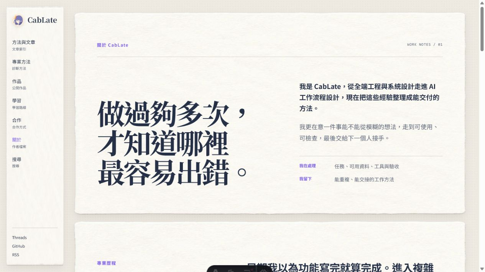
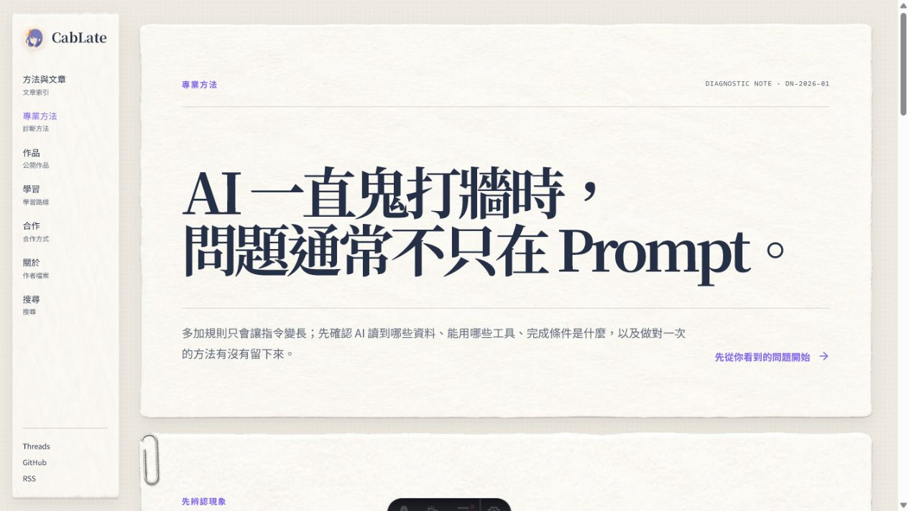
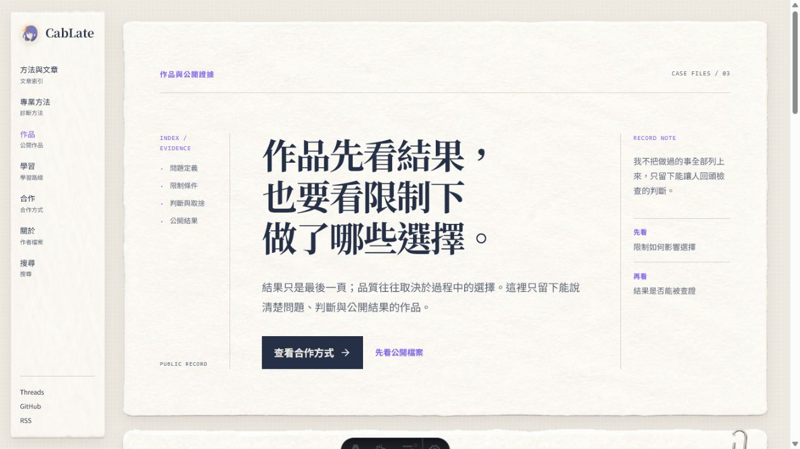
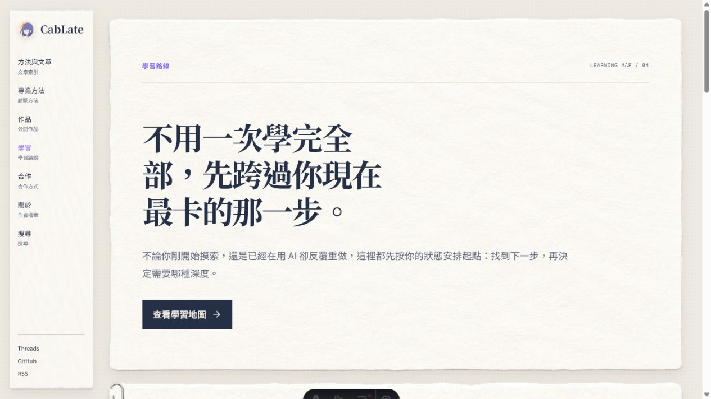
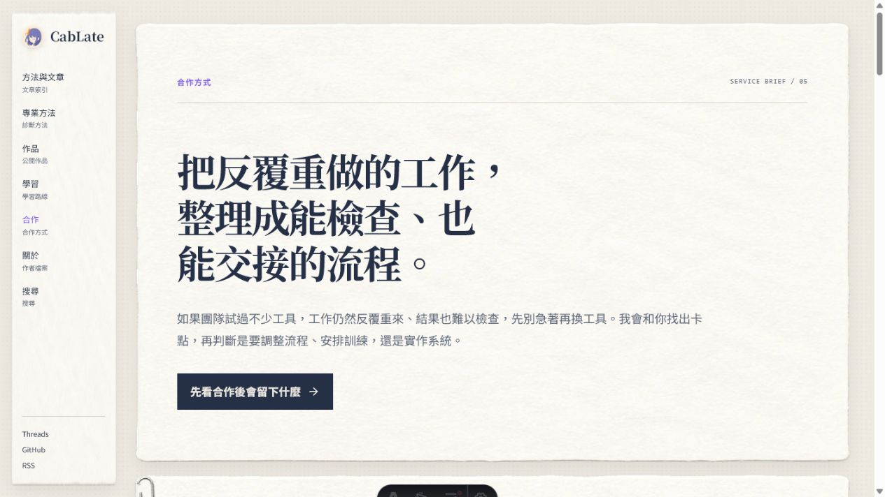
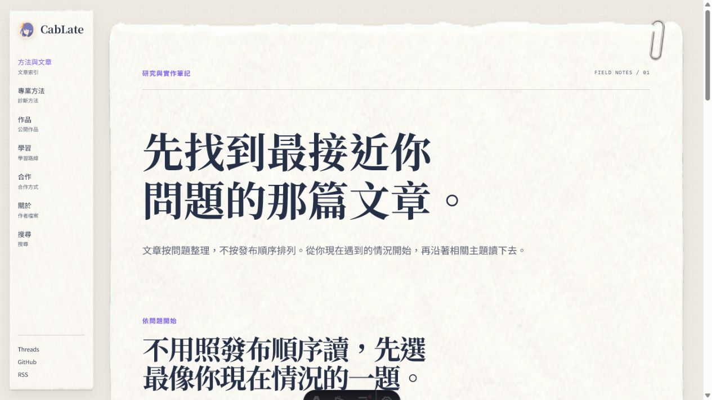

# CabLate current persona review

這份文件不是重做 7/12 audit，而是把它當成訪客問題的基線，再對照 2026-07-13 目前網站的實際畫面與 DOM 狀態，找出已經解決、仍殘留，以及下一輪真正值得調整的地方。

## Audit scope

本次檢查的訪客目標仍是：

> 先認出自己的 AI 工作失效情境，理解 CabLate 的判斷方法，再選擇文章、學習、作品或合作其中一個合理的下一步。

這一輪只檢查七個主要入口頁的第一屏與首個可見分流，不改程式、不處理 P3 裝飾；文章內頁、課程內容頁、搜尋頁也維持不在範圍內。

證據截圖存放於 [`2026-07-13-current-persona-review/`](2026-07-13-current-persona-review/)。每張截圖都是本輪從目前 local site 擷取並檢查過的畫面。

## Five visitor obstacle replay

這一節才是本次 review 的核心：不是只問「頁面好不好看」，而是逐一重播訪客從第一眼到下一步的心理變化。以下判斷以 7/12 audit 的五種訪客為基線，再對照目前程式中的實際分流與 CTA。

### 1. AI 初學者：我到底該從哪裡開始？

- **目前感受：** Home 的 H1 先說中「重做、走偏、不敢交付」，接著用任務、資料、工具、完成標準解釋原因，這段會讓人先鬆一口氣；Expertise 的中文白話名稱也已降低術語恐懼。
- **真正障礙：** Hero CTA「找出問題卡在哪一層」只會捲到三張靜態診斷卡；三張卡沒有直接的文章或檢查入口。訪客會知道自己有問題，卻還要再往下找到「選擇下一步」才能選 `/articles/`。
- **訪客可能想：**「我知道問題大概在哪，但現在要點哪裡才會真的開始？」
- **調整方向：** 每個診斷情境補一個最小出口（先看對應問題文章／先做診斷），讓 CTA 從『看懂』直接接到『開始』；不要把初學者先推到 Courses 或 Services。

### 2. 已在使用 AI、但總是重做的個人工作者：先給我一個能解決今天問題的入口

- **目前感受：** Home 的診斷主張、真實追查案例與 Articles 的「讀完會知道什麼」已形成可信的閱讀路徑，挫折可以轉成「問題能拆開」。
- **真正障礙：** Home 的診斷卡仍是說明文字，不是問題索引；訪客必須先看完核心主張，再從另一個「選擇下一步」區塊重新選文章。這會讓最需要快速解法的人多一次決策。
- **訪客可能想：**「我已經知道自己在重做，為什麼還要再逛一個選單？」
- **調整方向：** 將診斷情境與 Articles 的問題路線一一對接；保留追查案例作信任證據，但不要讓工程手冊或合作 CTA 先搶走入口。

### 3. 想把一個想法做完的開發者：請先證明你真的交付過

- **目前感受：** Work 的「結果／限制／選擇／公開證據」結構可信，Courses 也已把可開始與尚未開放分開。
- **真正障礙：** Work 首屏的深色 Primary CTA 是「查看合作方式」，「先看公開檔案」反而是次要文字連結。對尚未建立信任的開發者，第一個動作應該是看案例，不是談合作。
- **訪客可能想：**「我還不知道你做過什麼，為什麼先叫我合作？」
- **調整方向：** Work 首屏將公開檔案升為主要 CTA；案例摘要先露出公開結果，再讓 Courses 成為學習下一步，Services 不在此刻競爭。

### 4. 企業／團隊決策者：我想快速判斷是否適合，不想先讀完方案百科

- **目前感受：** Services 的 H1、成果承諾與「先看合作後會留下什麼」符合決策者先看成果再評估風險的習慣。
- **真正障礙：** 目前要從多組 `fit / deliverables / not fit` 自己拼出「我們適不適合」；頁面也沒有在首屏或成果段落直接連到公開案例，信任證據與合作入口是分開的。最後主要聯絡方式是 Threads，對企業訪客來說不是很明確的提交流程。
- **訪客可能想：**「你能留下什麼我大概懂，但我們現在是否適合、要提供什麼資料、怎麼開始？」
- **調整方向：** Services 依「適合誰 → 會留下什麼 → 合作流程 → 提交情境」收斂；在成果段落補一個公開案例入口，最後只保留一個明確的合作提交動作。

### 5. 熟人／合作轉介者：我能不能用一句話把你介紹給別人？

- **目前感受：** About 首屏已清楚說出「全端工程 → AI 工作流程設計 → 可交付方法」，比舊版更能回答「你現在在做什麼」。
- **真正障礙：** 首屏沒有立即的作品或合作 CTA；訪客要讀到後面才看到代表作品，或自行使用側欄的「作品／合作」。這會讓轉介者知道你是誰，卻還不能快速確認應該把誰介紹過來。
- **訪客可能想：**「我理解你的方法了，但我要先看哪個案例，或把哪種團隊介紹給你？」
- **調整方向：** 在 About hero facts 後補一個低權重「看代表作品」入口，並在作品段落提供清楚的 Services 轉接；GitHub／Threads 保留為補強，不與主要分流競爭。

## Current flow review

### 1. Home — 找到問題入口

**狀態：健康，保留現有結構。**

- 第一眼能讀到「讓 AI 把工作做完，成果也能放心交付」，主張與訪客的重做／不敢交付情境直接相連。
- 右側照片建立真實感，左側 CTA「找出問題卡在哪一層」是低門檻且單一的第一步。
- 目前沒有明顯裁切或 CTA 越界；Hero 的視覺比文字重，但仍能理解入口。
- 下一輪只需確認往下滑後三條路徑是否仍維持同樣清楚，不需要重新設計首屏。

### 2. About — 理解這個人為什麼這樣工作

**狀態：大致成立，下一步提示可再補。**

- H1、右側自我介紹與「整理成能交付的方法」已經把經歷和現在的工作方式接起來。
- 第一屏的情緒是「這個人做過足夠多次，所以知道哪裡會出錯」，符合熟人／轉介者的閱讀需求。
- 第一屏沒有明確的下一步按鈕；訪客必須往下讀到作品區，才能決定是否繼續看證據。
- 下一輪可在 hero facts 後補一個低權重的「看代表作品」入口，不需要增加新內容區塊。

### 3. Expertise — 把模糊症狀轉成排查入口

**狀態：健康，主要問題已解決。**

- H1 直接說中「AI 一直鬼打牆」的感受，右側「先從你看到的問題開始」提供明確行動。
- 原 audit 擔心的術語門檻已由「執行環境／資訊脈絡／可重複方法」等白話名稱降低。
- 第一屏只承諾診斷，不把三種工程術語塞給訪客；閱讀順序合理。
- 下一輪只需確認往下滑後每個症狀都有一個可理解的出口，不需要改首屏。

### 4. Work — 先看證據，還是先談合作

**狀態：內容成立，但 CTA 層級仍有殘留問題。**

- 「結果、限制、選擇」的檔案語法讓訪客知道這裡不是作品集縮圖，而是可檢查的判斷證據。
- `RECORD NOTE` 已完整可見，原 P1 裁切問題已消失。
- 目前深色 Primary CTA 是「查看合作方式」，紫色次要連結才是「先看公開檔案」。對第一次來、想確認能力的訪客來說，順序反了：應先看證據，再決定是否合作。
- 下一輪應把「先看公開檔案」設為此頁首要動作；Services 保留為次要轉換入口。

### 5. Courses — 選一條現在走得動的路線

**狀態：健康，但起點要更早出現。**

- H1 清楚降低「要一次學完全部」的壓力，CTA「查看學習地圖」符合探索情境。
- 目前可開始／尚未開放狀態已在學習地圖中區分，原 audit 的商品牆風險已降低。
- 第一屏只看到入口，還看不到哪一條是「建議起點」；對急著開始的人仍要再滾動一次。
- 下一輪可在 CTA 附近補一行建議起點，或讓學習地圖第一條路線更早露出，不增加新的課程文案。

### 6. Services — 判斷是否值得合作

**狀態：主張成立，但決策成本仍偏高。**

- H1 與副文案先處理「反覆重做」的情境，再承諾留下可檢查、可交接的流程，方向正確。
- CTA「先看合作後會留下什麼」比直接要求聯絡更自然。
- 第一屏右側留白較大，往下的合作選項又會展開成多組 `fit / deliverables / not fit` 資訊；訪客仍需要自己整理「我適合哪一種」。
- 下一輪應按「適合誰 → 會留下什麼 → 怎麼合作 → 提交情境」收斂，先給判斷，再給細節；不是再增加紙卡。

### 7. Articles — 從問題進入閱讀

**狀態：健康，保留問題索引方向。**

- H1 直接承諾「找到最接近你問題的那篇文章」，比最新文章導向更符合訪客意圖。
- 副文案說明不必照發布順序讀，閱讀規則清楚。
- 問題路線在第一屏下方開始出現，摘要也已改成「讀完會知道什麼」的承諾。
- 下一輪只需確認分類／標籤不搶走問題入口，不需要重做文章首頁。

## What the previous audit got right, and current status

| Previous finding | Current status |
|---|---|
| 跨頁內容裁切（P1） | 程式與目前 live QA 已修正；目標 1440／390 viewport 的修正後截圖仍應補作 production evidence |
| 首頁巢狀 `<main>` | 已修正，七頁各一個 main |
| Carousel 語意與鍵盤 | 已補 region／slide role／`aria-hidden`，箭頭、圓點、左右鍵已驗證 |
| 標題空格與斷句 | 七頁標題已回讀，沒有 edge space 或連續空白 |
| Expertise 術語門檻 | 已補白話名稱，首屏閱讀順序成立 |
| Articles 摘要收穫 | 已補「讀完會知道什麼」敘述 |
| Courses 商品牆風險 | 已突出目前可開始狀態；仍可讓建議起點更早可見 |
| Work 手機先看結果 | 已加入公開結果摘要；桌機 CTA 順序仍需調整 |
| Services／Work／Courses 內容密度 | 尚未完全解決，Services 是優先項 |
| Focus-visible／reduced-motion 實機證據 | 程式已有 fallback；真實媒體模擬與 skip-link focus 仍未完成 |
| Newsletter 實際寄送 | 尚未驗證 |
| P3 紙面裝飾 | 明確不在本輪 |

## Recommended next adjustment plan

### P2-A — 先修訪客決策順序

1. **Work：** 將「先看公開檔案」升為 Primary，合作方式降為次要 CTA。
2. **Services：** 把合作內容收斂成「適合誰／會留下什麼／怎麼合作／提交情境」四個判斷段落；保留證據，但延後細節。
3. **About：** 在首屏 facts 後補低權重作品入口，讓轉介者不用猜下一步。
4. **Courses：** 讓「建議起點」在第一個 CTA 附近出現，減少一次滾動與選擇成本。

### P2-B — 再做 production evidence

1. 以 1440 × 900、1280 × 720、390 × 844 重新截取七頁，確認 P1 修正後的標題、CTA、索引、footer 與紙張邊界。
2. 用真實鍵盤流程驗證 skip link、固定導覽、手機選單、Work／Services CTA 與 carousel focus。
3. 用 reduced-motion 環境重跑 carousel、hash scroll 與選單。
4. 補 404／privacy／archive smoke test，另行記錄 Newsletter 寄送與 8 個 asset warnings 的 owner／處理決定。

### P2-C — 最後才做視覺 polish

P3 紙張裝飾、迴紋針密度與素材變化仍維持暫緩；它們不能先於訪客是否理解與選擇下一步。

## Evidence limits

- 本輪截圖是目前 local site 的七個入口頁第一屏，viewport 為 1280 × 720；沒有把舊截圖當成本輪證據。
- 本輪沒有在真實 390 × 844 viewport、reduced-motion 或實體鍵盤環境完成完整互動驗證。
- 截圖可以支持閱讀順序、視覺層級與 CTA 是否明顯，但不能單獨宣稱完整 WCAG compliance。
- 文章內頁、課程內容頁、搜尋頁與 Starter Pack 仍不在本輪範圍。

## Review conclusion

目前不是「整站還要重做」，而是已經有一個成立的入口系統，剩下要把訪客的決策順序再收斂：Work 先證據、Services 先適配、About 補下一步、Courses 提早起點。完成這四項後，再做一次目標 viewport 與 accessibility production gate，才值得進入 P3。

## Implementation follow-up — 2026-07-13

本輪已完成上述訪客決策順序調整：

- Home 三個診斷情境各自加入一個對應問題入口，訪客不必讀完另一組路徑選單才開始處理問題。
- Work 將「先看公開檔案」升為 Primary CTA，「查看合作方式」降為次要入口。
- Services 改為先判斷適配情境，再閱讀合作成果、公開證據、合作流程與提交方式；同時移除每個方案重複出現的「暫時不適合」說明，降低閱讀密度。
- About 在首屏 facts 後加入適合轉介的對象描述與「先看代表作品」入口。
- Courses 在第一個 CTA 下直接標示免費問題診斷為建議起點。

本輪驗證結果：

- `npm run check`：0 errors、0 warnings、17 個既有 hints。
- `npm run validate:content`：通過。
- `npm run build`：49 pages built；8 個既有 public asset warnings 仍保留。
- `git diff --check`：通過。
- 1440 × 900 與 390 × 844 的五個受影響頁面皆為一個 main landmark，且 `scrollWidth === clientWidth`。
- 手機版逐一檢查 Home 診斷、Work 公開檔案、Services 適配段、About 首屏與 Courses 起點，未發現標題、連結或 CTA 超出可見寬度。

本輪截圖證據存放於 [`2026-07-13-five-persona-implementation/`](2026-07-13-five-persona-implementation/)。P3 紙面裝飾、Newsletter 實際送達與 8 個既有 asset warnings 仍不在本輪處理範圍。
