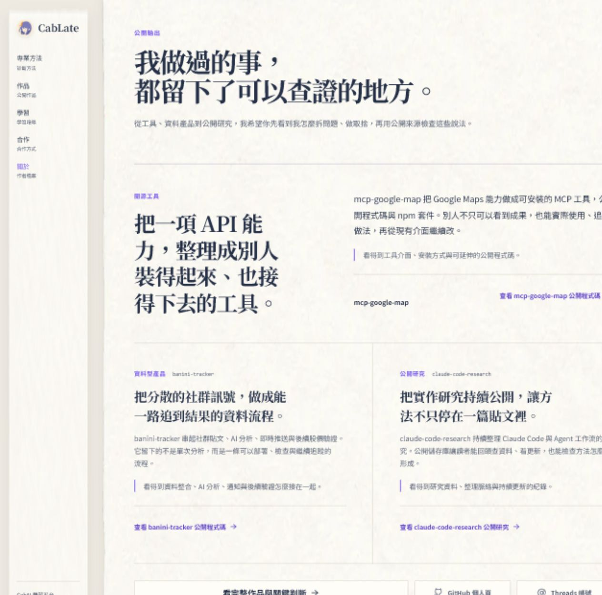
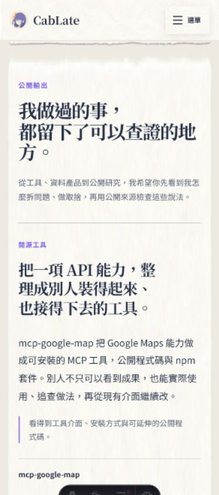
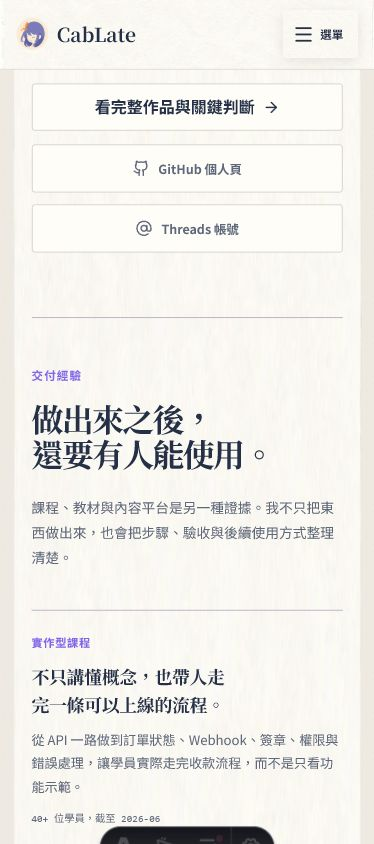
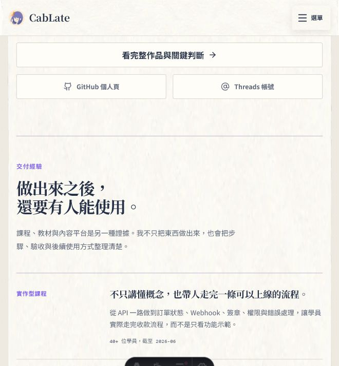

# About 公開輸出區視覺檢查

檢查範圍：`/about/#public-output-title` 到交付經驗區塊開頭。

## 結論

版型穩定，桌面、675px 中間寬度與 390px 手機版都沒有橫向溢位或元件重疊。整體已對齊 Master Plan 的信任累積順序：公開輸出建立可信度，Work 是主要深入路徑，GitHub 與 Threads 是次要人物入口，接著再銜接交付經驗。

## 證據與發現

1. 桌面版（1280px）：健康。主案例與兩個輔助案例的 1+2 層級清楚，作品敘事比 repo 指標更突出。

   

2. 手機版內容（390px）：需要一項排版微調。主標第二句在窄螢幕留下單獨一行「方。」，閱讀沒有問題，但視覺節奏不完整。

   

3. 手機版行動區（390px）：健康。Work 以較大、較深的文字維持主導性，GitHub 與 Threads 雖然同為滿版按鈕，仍保有次要層級；三個點擊目標皆約 48px 高。

   

4. 中間寬度（675px）：健康。Work 單獨一列，兩個社群入口並列，主次比手機版更自然。

   

## 可調整項目

- P1：修正手機主標的孤行，可在窄螢幕取消固定換行或只對這個標題使用平衡斷行。
- P2：按鈕文字對比約 5.5:1，辨識良好；但邊框與按鈕底色約 1.5:1，正常視覺下略淡。若希望入口更有存在感，可只加深一級邊框，不需要改成實心按鈕。
- P3：支援案例旁的 repo 名稱約 10.24px，在紙張紋理上偏小。它不是主要內容，可接受；若要強化可查證感，可微升至約 0.7rem。

## 證據限制

本次確認涵蓋截圖、實際重排、元素尺寸、溢位與主要色彩對比；未宣稱完整 WCAG 合規，也未執行螢幕閱讀器測試。
