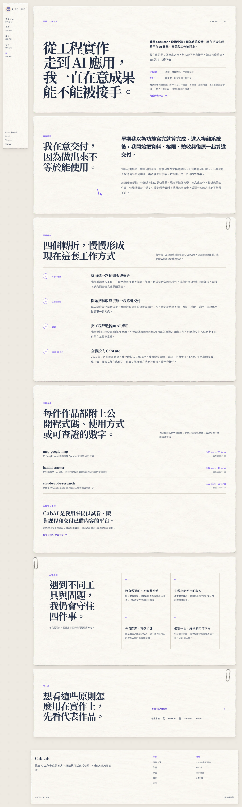
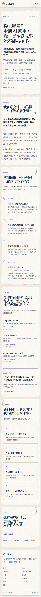
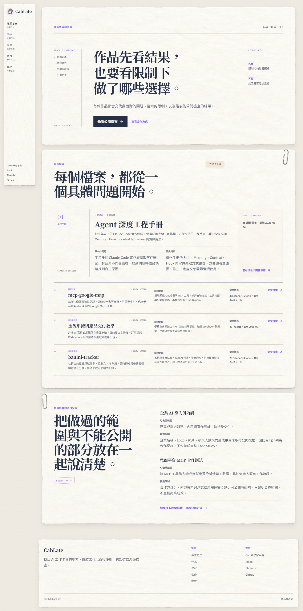
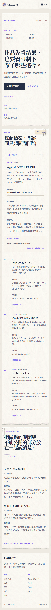
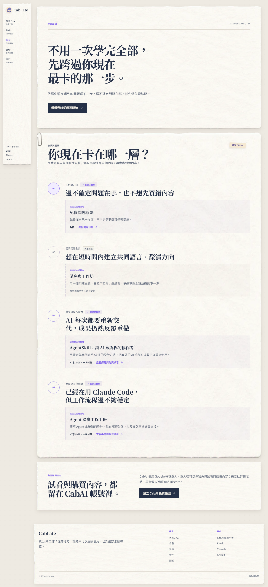
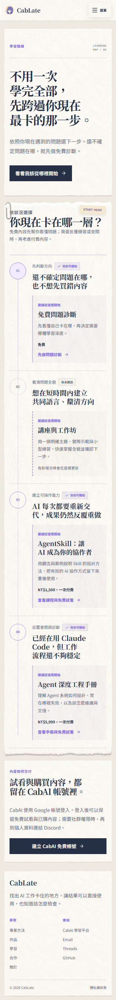
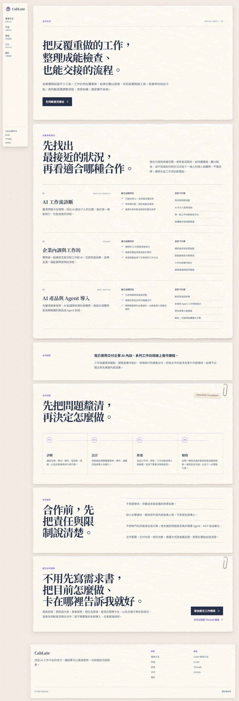
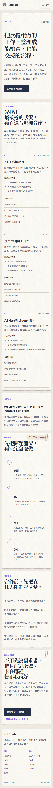

# About、Work、Courses、Services Production Audit

## 1. 稽核目的與範圍

這份稽核保存四個主要內頁在開始下一輪設計前的 production baseline。目標不是證明「頁面已完成」，而是確認目前真實畫面、互動層級與內容節奏，讓後續 Master Plan 能逐項對照，而不是只憑 class、DOM 或記憶規劃。

本輪檢查：

- About、Work、Courses、Services 的完整 Desktop 與 Mobile 長頁。
- 首屏任務、紙張區塊、頁面專屬視覺語法、主要標題與 CTA 層級。
- runtime 中的 heading、link、section、實際尺寸、頁面高度與水平溢位。
- 畫面可直接辨識的可及性風險。

不在本輪範圍：

- 不修改四頁程式或文案。
- 不恢復站內 Article CTA。
- 不處理 Article detail、Course detail、搜尋或已移除的 Starter Pack。
- Rail 與 Footer 只確認跨頁一致性，不重新設計。
- 不以截圖宣稱完整 WCAG compliance；完整鍵盤流程、螢幕閱讀器、縮放、對比與 forced-colors 仍須在實作階段另外驗證。

Home 與 Expertise 已完成的閱讀、CTA、流程與響應式標準，是後續四頁的品質基準，但四頁仍須保留各自的版面語法，不能複製成同一種紙卡模板。

## 2. 證據方法與整體健康度

八張截圖均取自本輪 production runtime，並已逐張人工開啟確認：頁面正確、內容完整、沒有 Dev Toolbar、沒有載入中或錯誤裁切，也沒有空白長頁。Desktop 使用 1440 × 900，Mobile 使用 390 × 844；每張皆為完整長頁截圖。

runtime facts 顯示八個狀態皆符合 `scrollWidth === innerWidth`，因此目前沒有水平溢位。這只代表布局底線成立，不代表 CTA 已可辨識、標題斷句自然或閱讀任務已完整。

| 頁面 | Desktop 高度 | Mobile 高度 | 紙面區塊 | 整體判定 |
| --- | ---: | ---: | ---: | --- |
| About | 4794px | 5501px | 6 | 人物與時間軸語法成立；首屏與 CabAI 行動辨識不足，Mobile 敘述偏長。 |
| Work | 2901px | 4587px | 3 | 案例檔案語法清楚；Mobile 手冊 CTA、長卡連結與頁尾合作 CTA 需要重做層級。 |
| Courses | 3148px | 3344px | 3 | 學習地圖成立；真正可走的三條路線仍是 23px 小字，且編號可能誤導為必修順序。 |
| Services | 4202px | 5713px | 6 | 合作 brief 完整；Mobile 最長，服務敘述重複、合作經驗缺 heading、次要聯絡 CTA 過弱。 |

完整量測資料保存在 [`runtime-facts.json`](./runtime-facts.json)。

## 3. About

### Desktop：1440 × 900

健康度：畫面完整、紙張安全範圍正常、時間軸與公開作品層級可辨識，無水平溢位。

### Mobile：390 × 844

健康度：完整長頁、時間軸由三欄正確轉為垂直閱讀，紙張未裁切，無水平溢位；總高 5501px，重複敘述會放大捲動負擔。

### 優點

- Hero 能快速回答 CabLate 是誰、做過什麼，以及在意何種交付問題。
- 「四個轉折」以時間軸呈現，符合「工作筆記」而不是履歷卡片的頁面語法。
- 開源作品與可查證數字靠近能力主張，能支撐信任。
- CabAI 被放在內容交付能力的脈絡中，而不是在 About 硬推商品。
- 頁尾以 Work 作為主要去向，符合「認識人之後看實作證據」的決策順序。

### UX／設計問題

- 首屏「先看代表作品」只有 105 × 23px。高意圖訪客雖找得到文字，掃讀時不容易辨認它是重要行動。
- CabAI 的能力證據成立，但「查看 CabAI 學習平台」只有 145 × 22px，又落回紫色小字。
- Hero、交付信念與時間軸前言都在解釋「做出來不等於能交付」，需要保留不同功能、刪掉重述。
- Mobile 長達 5501px；應收斂重複敘述，不能用刪除人物證據或縮小字體解決。
- H1 已有人工作句組；其他 H2 仍需在 320、360、390px 個別確認，不能只靠 `text-wrap` 自動換行。

### 可見 accessibility risks

- 兩個重要文字連結的視覺與互動區域偏小，雖可操作，仍可能被誤認為補充文字。
- 外部作品整列皆為連結，需在實作階段確認 focus-visible、accessible name 與鍵盤掃讀節奏。
- 截圖無法證明時間軸螢幕閱讀器順序、外部連結提示或 forced-colors 呈現。

## 4. Work

### Desktop：1440 × 900

健康度：三層案例檔案結構完整，Featured case、公開案例與有限揭露合作可清楚區分，無水平溢位。

### Mobile：390 × 844

健康度：內容沒有裁切或溢位，但三張次要案例各約 326 × 417px，整張長卡成為連結，閱讀與焦點負擔偏高。

### 優點

- Hero 明確建立「先看結果，也看限制下的選擇」這個案例閱讀框架。
- Featured handbook、其他公開檔案、有限揭露合作紀錄有清楚的證據層級。
- 公開數字附日期，合作限制也有揭露，符合誠信原則。
- 頁面已具備「先看證據，再談合作」的正確決策順序。

### UX／設計問題

- Featured handbook CTA 在 Desktop 是 171 × 53px，Mobile 卻退回 134 × 21px；同一重要行動跨 viewport 失去層級。
- 三張次要案例把整個 417px 長卡做成唯一 anchor，accessible name 過長，真正的「查看檔案」反而不明顯。
- 次要案例在 Mobile 使用相同密度反覆堆疊，頁面由 2901px 增至 4587px。
- 頁級真正的轉換是讀完證據後前往 Services，但頁尾「如果你有相似情境，查看合作方式」只有 226 × 23px。
- Hero 的「查看合作方式」也是 77 × 22px；對已經準備合作的訪客過於隱晦。

### 可見 accessibility risks

- 長卡 anchor 會讓鍵盤焦點範圍、可見焦點與朗讀名稱過重；應改為語意 article 加獨立 action row。
- `#selected-work` 是首屏主要 anchor，實作後必須驗證 Mobile sticky Headbar offset。
- 截圖無法證明外站連結、Enter、focus-visible 與長卡朗讀結果。

## 5. Courses

### Desktop：1440 × 900

健康度：學習地圖、狀態與 CabAI 帳號區塊清楚，無水平溢位。

### Mobile：390 × 844

健康度：路線完整堆疊、商品資訊未裁切，無水平溢位；真正可採取的行動仍以小字呈現。

### 優點

- 頁面以訪客卡點而不是商品分類作起點，符合學習地圖任務。
- 免費診斷、講座與工作坊、AgentSkill、工程手冊四種深度皆被保留。
- 可開始與尚未開放狀態真實，不為未開放講座製造假連結。
- CabAI 說明試看、購買與交付集中在同一帳號，角色正確。

### UX／設計問題

- 三條目前可走路線的 CTA 全是 23px：問題診斷、課程免費試看、手冊免費試看。這與 Expertise 曾遺漏的重要按鈕屬於同一類問題。
- 編號與垂直導引線容易被看成「必須由 01 依序完成到 04」，但頁面真正任務是選現在需要的一條。
- Hero 與 map header 都在重複「卡在哪／選下一步」，需要讓一個負責定位、一個負責選擇規則。
- CabAI 帳號的深色按鈕比具體商品路線更搶眼，可能把訪客從明確選擇拉回抽象註冊。

### 可見 accessibility risks

- 重要路線只靠紫色文字與箭頭暗示可點，辨識與觸控區域不足。
- 若編號、線段與 DOM 語意沒有明說「不是必修順序」，視覺可能傳達錯誤資訊。
- `#learning-map` 必須在 320、360、390px 驗證 Headbar offset、焦點與跳轉後標題位置。
- 截圖無法確認價格與狀態在輔助技術中的關聯名稱。

## 6. Services

### Desktop：1440 × 900

健康度：合作情境、交付、流程、邊界與聯絡均存在，Desktop 層級可辨識，無水平溢位。

### Mobile：390 × 844

健康度：內容完整但高達 5713px，是四頁最長；三種服務重複兩組清單，是主要捲動負擔。

### 優點

- Hero 直接對應反覆重做、難以檢查與交接的合作情境。
- 三種合作、實際交付經驗、四步流程、合作邊界與聯絡方式齊全。
- 合作 Email 是真實的 `mailto:cablate@cablate.com`，不是只顯示文字。
- 合作經驗的份量已能建立信任，也誠實說明未公開客戶內部資訊的原因。
- Email 是唯一清楚的頁尾主要行動，符合 Services 頁面任務。

### UX／設計問題

- 三種服務重複「適合情況＋會留下什麼」，Mobile 閱讀密度過高；要保留判斷力，不是把每個資料欄位全塞上去。
- 四步流程中的「推進」是內部抽象用語，不如「執行」直觀。
- 合作經驗目前只有 `<aside aria-label>` 與段落標籤，沒有真正 heading element，視覺存在、文件大綱卻缺了一節。
- Threads fallback 只有 177 × 23px，對不方便寄信的人不夠像可行的次要聯絡方式。
- 邊界與三種服務適配條件部分重複，需要清楚分工：服務卡回答「適不適合」，邊界回答「合作前雙方要接受什麼」。
- `serviceTracks.notFit` 仍存在 `src/config/authority.ts`，目前未渲染；若後續不再使用，應在確認無其他引用後移除 dead data。

### 可見 accessibility risks

- 缺少「合作經驗」heading 會削弱 landmark 內的語意導覽。
- `#service-options` 必須在 Mobile 驗證 sticky Headbar offset。
- Threads 次要 CTA 需要至少 44px 互動高度與非僅顏色的邊界提示。
- 截圖無法確認 `mailto:`、外站連結、鍵盤順序與 forced-colors 狀態。

## 7. 跨頁共同發現

1. **CTA 檢查不能停在 href 存在。** 四頁都出現重要行動落回 21–23px 紫色小字的情況；後續計畫必須逐一列出 role、外觀、尺寸、位置、Mobile 與互動 states。
2. **流程名稱出現不等於流程已設計。** Timeline、case index、learning route、service process 都要定義語意順序、DOM 順序、Desktop／Mobile、編號、方向與回復路徑。
3. **Mobile 長度要靠資訊分工處理。** 不用縮字、固定高度或裁切；應刪除重述、縮短低價值清單，保留能改變決策的證據。
4. **標題要以真實畫面驗收。** 主要 H1／H2 必須預先分句組，並在 320、360、390、1280、1440px 看實際斷行。
5. **頁面必須共用品牌，不共用敘事模板。** About 是工作筆記與時間軸、Work 是案例檔案、Courses 是學習地圖、Services 是合作簡報。
6. **紙張材質不能取代互動層級。** 紙面背景、迴紋針與標籤只協助分組；它們不能讓普通小字自動變成 CTA。

## 8. 稽核限制與結論

這份稽核可以支持下一步規劃，但不能單獨證明完整的功能或可及性品質。實作階段仍需逐頁執行：原生元素與 href、accessible name、focus-visible、Enter、anchor offset、320／360／390／1280／1440px、forced-colors、`npm run check`、`npm run build` 與新一輪 production 截圖。

結論：四頁都已有正確的內容骨架與專屬視覺方向，不需要推翻；需要的是 CTA 層級、順序語意、Mobile 密度、標題斷句與語意結構的精修。基線已足以撰寫可執行 Master Plan，但在使用者核准計畫與逐頁完成驗證前，不應標示為 Ready。
