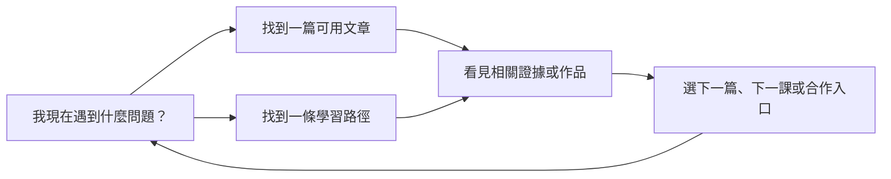

# About、課程與文章：下一輪怎麼改

讀者：要決定內容頁、作品入口與文章閱讀系統怎麼改的人  
用途：先做決策；需要逐頁證據時再查[完整審核](./2026-08-17-content-about-director-audit.md)

## 先修三個明確問題

1. **文章 Newsletter 初始就露出空紅色錯誤區。** 這是可見 bug，先修。
2. **手機長文缺少章節入口與程式碼／表格的橫滑提示。** 工程證據因此不容易閱讀。
3. **決定 `/work/` 的歸屬。** 現在 `/work/` 回應 200，最後卻落到 `/about/#public-output-title`；導航、正式網址與分享語意沒有收斂。

這三件事完成後，再重畫紙張層級與內容發現路徑。

## 內容應形成一條回路

目前 About、Courses、Articles、Tags 和文章 detail 都有內容，但讀者必須自己猜下一步。



每個頁面只要負責回路中的一個問題，不要同時塞滿所有入口。

## 各頁的決策

| 頁面 | 目前優點 | 主要問題 | 下一輪改法 | 完成標準 |
|---|---|---|---|---|
| About | 第一人稱判斷與公開產出已建立人格 | 紙卡、時間線、原則與 CTA 權重太接近；成果證據被其他內容稀釋 | 讓公開產出成為主證據，其他段落改用時間線、批註或無框留白 | 讀者能快速找到一項成果、來源、日期與下一步 |
| Courses | 依讀者狀況分成四條路 | 四條入口等權；重複「目前可開始」；內層紙卡過多 | 強化每條第一個成果；不確定的人只保留一個 fallback | 讀者不需理解課程架構就能選一條路 |
| Articles | 已有「依問題開始」的好入口 | topic、其他文章與 route 的優先順序仍會重複 | 明確寫出每條路看完能完成什麼 | 兩次點擊內到達與問題相關的證據 |
| Tags | 29 個 tag 都可進入 | 只有名稱與數量，缺少問題／工具／方法分組 | 加少量功能分組或從文章帶入 context | 讀者知道為什麼要點某個 tag |
| 文章內頁 | 程式碼、表格、差異比較與技術內容具體 | 手機目錄消失；程式碼／表格需猜測可橫滑；結尾卡片過多 | 補手機章節入口與滑動提示；依文章任務重排結尾 | 兩次互動內到任一二級標題；證據不被截斷或藏起來 |
| Work | 作品集中在 About 內已有內容 | `/work/` 的頁面歸屬與正式網址不清楚 | 決定獨立作品頁或正式轉址，不維持模糊中間態 | 搜尋、分享、導覽只指向一個正式位置 |
| Privacy／Confirmation／404 | 低裝飾、任務清楚 | 部分小標仍像模板；流程狀態尚未完整驗證 | 維持安靜文件模式，只保留功能性狀態 | 讀者知道現在發生什麼、下一步去哪裡 |

## 紙張不是不能用，而是要分工

```text
About        = 公開工作檔案
Courses      = 學習路徑圖
Articles     = 研究索引
Article      = 可標註的實驗紀錄
Privacy      = 安靜的正式文件
Confirmation = 清楚的流程結果
```

同一品牌可以共享紙張、navy、紫色、serif／sans／mono 字體角色；但每頁必須有不同的主要動詞。不要再靠 `paper-card + clip + 英文小標` 區分頁面。

## 文章閱讀系統先怎麼修

```diff
- 桌面有固定目錄，手機完全沒有
+ 手機提供可展開目錄、章節選單或短章節列

- 程式碼／表格只設定可捲動，讀者要自己猜可以滑
+ 在第一次出現時提供「可左右滑動」提示或手機摘要

- 結論後固定堆 newsletter、related、FAQ、nav、comments
+ 依這篇文章的下一個合理行動排序，只保留必要模組
```

文章的程式碼、表格與差異比較是證據，不是附屬裝飾。閱讀設計必須先保住這些內容。

## 小標清理規則

以下資訊可以保留小字：日期、分類、狀態、資料來源、數量與操作提示。

以下小字應優先移除：`CHOOSE ONE`、`PUBLIC RECORD`、`FEATURED DOSSIER`、`EMAIL UPDATES` 等只負責營造氣氛的標記。

判斷方式：**拿掉後，讀者是否失去一項必要資訊？** 如果沒有，就刪除。

## 已確認與尚未確認

已確認：

- 指定 route 的 1440 與 390px 都沒有整頁水平溢位。
- 文章的程式碼區與表格可以捲動，但手機畫面中的內容會超出可視區。
- 文章目錄在 1024px 以下隱藏。
- Newsletter 初始狀態會露出空紅色 error slot。
- `/work/` 最後落到 `/about/#public-output-title`。

尚未確認：

- Lighthouse、Web Vitals、字型／圖片／第三方 script 成本。
- 完整鍵盤、VoiceOver／NVDA、200% zoom 與 reduced motion。
- ConvertKit 真實成功、錯誤、網路失敗與重複訂閱。
- `/work/` 在正式部署的轉址狀態、正式網址、網站地圖與舊連結策略。
- 哪些入口最常被使用；目前沒有 analytics 或真人 click test 證據。

## 建議修改順序

1. 修空紅色 error slot。
2. 補手機文章目錄與程式碼／表格的操作提示。
3. 決定 `/work/` 的正式歸屬。
4. 重排 About public output，讓證據成為主角。
5. 收斂 Courses 四條路與 Tags 分組。
6. 依文章內容建立專屬視覺道具，減少通用橫幅與結尾卡片堆疊。
