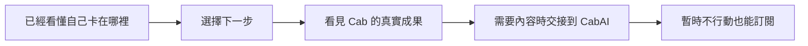

# 首頁後半段：下一輪怎麼改

讀者：要決定下一個首頁 section 怎麼改的人  
用途：先做決策；需要證據時再查[完整審核](./2026-08-17-home-remaining-director-audit.md)

## 先做這兩件事

1. **先改 Identity。** 放入一個真實成果，讓讀者看見 Cab 怎麼判斷、最後留下什麼。
2. **再改 CabAI 交接段。** 不再列平台功能，直接說讀者進去後可以完成什麼。

先不要替後半段加動畫。現在缺的是證據與敘事，不是動態效果。

## 現在為什麼卡住

上方診斷區已經成功說中讀者的問題。接下來應該讓讀者選路、建立信任，再決定是否前往 CabAI 或留下聯絡方式。



目前的畫面卻是連續紙張卡片：

```text
三列 CTA → 自我介紹 → CabAI 功能清單 → 表單 → 紙張 footer
```

每段都有內容，但沒有新的視覺主角。紙張因此從「工作文件」變成每段都套用的背景。

## 五個 section 的決策

| Section | 現在的問題 | 保留 | 下一輪改法 | 完成標準 |
|---|---|---|---|---|
| 下一步選擇 | `01／02／03` 把平行選擇誤畫成步驟；第一個行動按鈕又重複上方診斷 | 自己查、自己學、一起判斷三條路 | 改成真正的三選一分流；拿掉編號與重複健檢按鈕 | 10 秒內說得出三條路的差別 |
| 信任段 | 只有自我描述，沒有就地證據 | 「執行愈便宜，判斷愈重要」的立場與字體角色 | 放一個已核准的公開成果，例如案例、程式庫、註解文件或可驗收結果 | 不靠口號也能回答 Cab 做過什麼、留下什麼 |
| CabAI | 先介紹 Library、Skill、API 等內部分類 | 跨站 UTM 與 CabAI 作為學習承接平台 | 用一個真實產品畫面或交接成果，說明進去後的第一步 | CTA 說明結果，不只是「前往 CabAI」 |
| 電子報 | Email 欄位的鍵盤焦點幾乎看不見；外層與內層重複成兩個具名區域 | 真實寄送承諾、退出說明與欄位標籤 | 修正 `:focus-visible`；只保留一個具名區域；量測第三方程式再決定載入時機 | 鍵盤焦點清楚，初始／錯誤／成功狀態都可理解 |
| Footer | 又用一張完整紙張重講品牌與入口 | 兩組導航與法律連結 | 降為安靜收尾，不再新增主張或視覺焦點 | 最後一屏只負責離開、繼續或查政策 |

## 紙張怎麼留

紙張不用移除，但每張紙都要有工作。

```diff
- route、identity、CabAI、newsletter、footer 都是一張同級紙卡
+ 一個主要紙張物件負責證據或信件
+ 其他段落用留白、分隔線、底色或真實產品畫面建立層級
```

判斷問題只有一個：**如果拿掉紙張背景，這段還有自己的視覺理由嗎？** 如果沒有，應先找內容物件，不要換另一種紙。

## 已確認與尚未確認

已確認：

- 1440、760、390px 沒有整頁水平溢位。
- 信任段目前沒有成果物；原始碼明確保留尚未核准的證據位置。
- Newsletter input 取消 outline，只剩低對比陰影。
- 首頁會載入 ConvertKit 的外部表單程式。
- CabAI CTA 會保留跨站 UTM。

尚未確認：

- 真機 Safari／Android、螢幕閱讀器與 reduced motion。
- 正式站與本機版本是否完全一致。
- CabAI 最適合接住新訪客的第一個免費內容或登入狀態。
- 新增成果圖片後的效能成本。

## 建議修改順序

1. 信任段：先選真實成果，再決定版型。
2. CabAI：先定義讀者進去後的第一個結果。
3. 下一步選擇：移除編號與重複行動按鈕。
4. 電子報：修鍵盤焦點與重複具名區域。
5. Footer：降低視覺重量。

每次只改一個 section，保留修改前截圖，並在 390、760、1440px 重新驗收。
