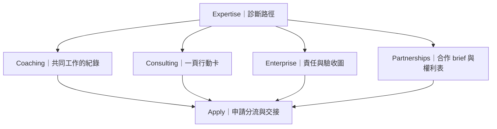

# Expertise 與服務頁：下一輪怎麼改

讀者：要決定服務頁改造順序與各頁方向的人  
用途：先做決策；需要逐 section 證據時再查[完整審核](./2026-08-17-services-expertise-director-audit.md)

## 核心決定

**停止讓所有服務共用同一套「hero＋卡片＋編號流程＋適合／不適合＋FAQ＋CTA」。**

內容已經能說明服務邊界，但畫面仍像換文案的同一頁。下一輪要讓每項服務圍繞自己的成果物構圖。



共同人格來自「先看證據、說清限制、留下下一步」，不是來自每頁都用相同紙卡。

## 先改哪一頁

先改 **Consulting**。它的範圍最小，也最容易驗證新的方法：

```text
帶一個真實問題來
  → 一起看證據與限制
  → 帶走一頁行動卡
```

這頁做成功後，再把方法分別轉成 Enterprise 的責任圖與 Partnerships 的合作文件。不要直接複製 Consulting 版型。

## 各頁的責任

| 頁面 | 讀者真正要判斷什麼 | 應成為主角的物件 | 目前最該移除或降低 | 完成標準 |
|---|---|---|---|---|
| Expertise | 問題出在資料、方法還是執行流程 | 症狀 → 可能層級 → 第一份證據 | 裝飾編號與泛用流程卡 | 讀者能選症狀，也知道先準備什麼 |
| Coaching | 是否適合持續一起拆問題 | 一次共同工作留下的判斷紀錄 | 通用適合／不適合雙欄與重複 CTA | 首屏看懂怎麼合作、每次留下什麼 |
| Consulting | 60 分鐘能解決到哪裡 | 一頁行動卡 | 通用四步流程、末段重複 CTA | 首屏同時看見輸入、輸出、時間與 NT$5,000 |
| Enterprise | 團隊該由誰決定、誰執行、誰驗收 | 責任／資料／驗收關係圖 | 三個等權方案卡與通用 fit grid | 不先買課，也知道會留下哪些責任與驗收結果 |
| Partnerships | 第一封邀約要寫什麼，權利怎麼確認 | brief → scope → rights → release 文件 | 通用五步流程與適合／不適合雙欄 | 1–2 分鐘能整理出可判斷的邀約摘要 |
| Apply | 目前申請哪一種服務、送出後會發生什麼 | 單一目前路徑＋表單狀態 | hero 與表單重複說明、已選後仍重複比較 | 四種 deep link 狀態一致，錯誤與成功都有下一步 |

## 三個跨頁優先問題

### 1. 所有頁面看起來太像

紙張、卡片、編號、FAQ 和 CTA 都以相同節奏出現。這會讓服務差異只存在於文字裡。

做法：每頁只保留一個主要成果物。紙張只有在代表文件、診斷或交接時才出現。

### 2. 手機只是把桌面往下堆

390px 沒有整頁水平溢位，但服務頁高度約 5,300–6,564px。長度不是唯一問題；真正的問題是每段都保留同樣權重。

手機前兩個 viewport 應先回答：

1. 這項服務適合什麼問題？
2. 我需要帶什麼？
3. 我會拿走什麼？
4. 下一步是什麼？

FAQ、完整流程與次要限制可以延後，但不能隱藏必要條件。

### 3. 裝飾小標太多

`section-label`、英文 kicker 與 `01／02／03` 經常沒有導航、狀態、來源或操作責任。

做法：逐一問「拿掉後會失去什麼資訊？」如果答案是「只少了氣氛」，就刪除。

## Apply：先保留什麼

Apply 已有不錯的語意基礎：欄位標籤、選項群組、錯誤總結、`aria-invalid`、漸進揭露與四種 `?service=` 路徑。空表單送出時，焦點會移到錯誤總結。

下一輪不要重做表單。先補齊狀態驗收：

| 狀態 | 必須回答 |
|---|---|
| 預設 | 我該選哪種服務？ |
| 已從服務頁進入 | 現在選的是什麼？可以怎麼改？ |
| 欄位錯誤 | 哪裡錯、怎麼回去修？ |
| 送出中 | 現在是否仍在處理？ |
| 成功 | Cab 接下來做什麼、何時回覆？ |
| 失敗 | 資料有沒有送出、現在可以怎麼辦？ |

## 已確認與尚未確認

已確認：

- 7 個 route 都有 1440 與 390px 截圖。
- 14 組 viewport 沒有整頁水平溢位。
- Apply 四種帶有 `?service=` 的直接連結狀態已截圖。
- 本機空表單會顯示錯誤總結、設定 `aria-invalid` 並移動焦點。

尚未確認：

- 正式環境 Turnstile、API、Email、重送與網路失敗。
- 真機 safe area、手機鍵盤與 sticky CTA 是否遮住焦點。
- 服務成果、價格與名額等內容是否都有最新來源。
- 正式環境的 Lighthouse、Web Vitals 與第三方程式成本。

## 建議修改順序

1. Consulting：用一頁行動卡驗證新方法。
2. Enterprise：改成責任與驗收圖。
3. Partnerships：改成 brief 與權利交接。
4. Coaching：定義長期共同工作留下的紀錄。
5. Expertise：把診斷路徑接到四種服務成果。
6. Apply：補齊正式環境狀態與手機操作驗收。
